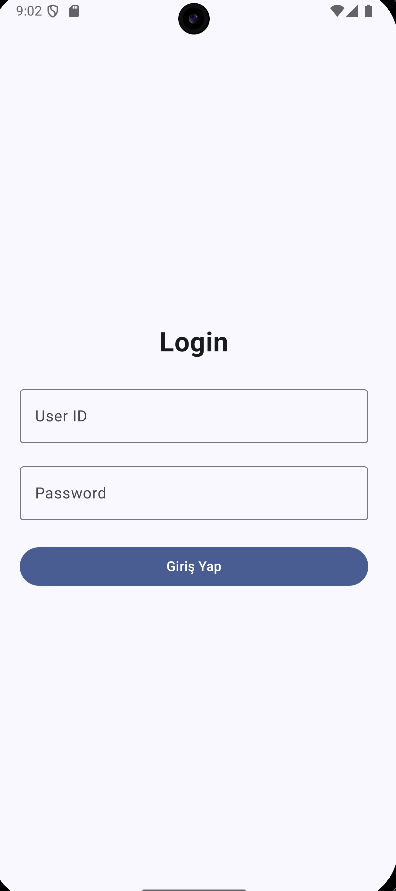
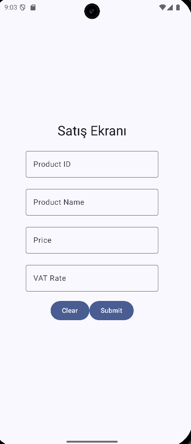
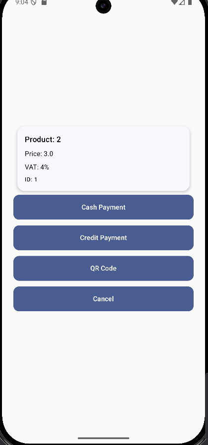
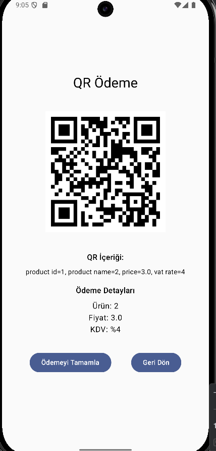

# SaleApp

A modern Android sales management application built with Kotlin and Jetpack Compose. This app provides a comprehensive point-of-sale solution for retail businesses, enabling seamless product sales and payment processing.

## Features

- **Secure User Authentication**: Protected login system to ensure only authorized users can access the sales system
- **Product Management**: Add and manage products with details like ID, name, price, and VAT rates
- **Sales Processing**: Intuitive interface for creating and completing sales transactions
- **Multiple Payment Methods**: Support for various payment options including cash, credit card, and QR code payments
- **Transaction History**: Keep track of all sales transactions with detailed information
- **Validation System**: Robust form validation to ensure accurate data entry
- **Modern UI**: Clean and responsive user interface built with Jetpack Compose

## Screenshots

<table>
  <tr>
    <td></td>
    <td></td>
    <td></td>
    <td></td>
  </tr>
  <tr>
    <td align="center"><b>Login Screen</b></td>
    <td align="center"><b>Sales Screen</b></td>
    <td align="center"><b>Payment Screen</b></td>
    <td align="center"><b>QR Payment Screen</b></td>
  </tr>
</table>

## App Workflow

1. **Login**: Users authenticate through a secure login screen
2. **Sales Entry**: Enter product information including ID, name, price, and VAT rate
3. **Payment Selection**: Choose between various payment methods (cash, card, QR code)
4. **Transaction Processing**: Complete the sale with selected payment method
5. **Receipt Generation**: Option to generate digital receipt for completed transactions

## Technical Details

- Built with Kotlin and modern Android development practices
- Jetpack Compose for building the reactive UI components
- MVVM architecture for clean separation of concerns
- Room database for efficient local data storage and retrieval
- State management through Kotlin Flow and StateFlow
- Navigation Components for seamless screen transitions
- Form validation with real-time feedback
- Coroutines for asynchronous operations

## Setup

1. Clone the repository
2. Open the project in Android Studio
3. Sync Gradle files
4. Run the application on an emulator or physical device

## Requirements

- Android Studio Hedgehog or newer
- Minimum Android API level 24 (Android 7.0)
- Kotlin 1.8.0 or higher

